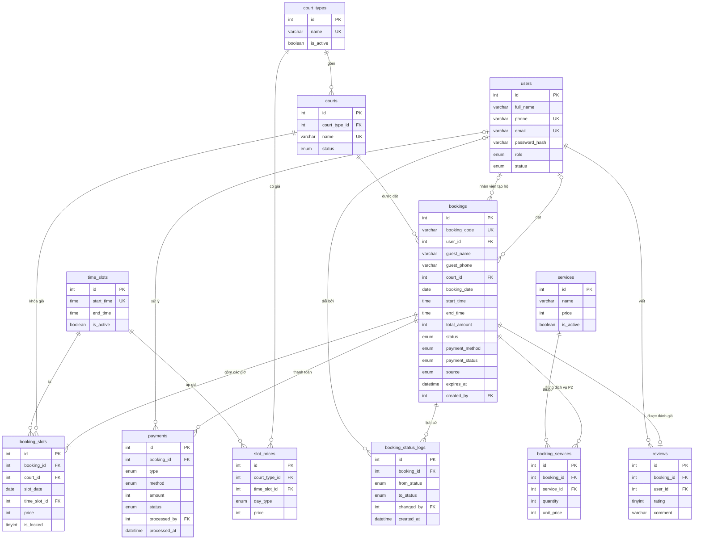

# 01 — DATABASE MySQL

> Trạng thái: **ĐỀ XUẤT / CHƯA TRIỂN KHAI**. MySQL 8.0.16+ (cần để `CHECK` có hiệu lực). Engine InnoDB, charset `utf8mb4`.

## 1. Nguyên tắc thiết kế

- Mỗi bảng tồn tại vì một nghiệp vụ cụ thể (mục 4).
- **Không xóa cứng** dữ liệu nghiệp vụ. Vô hiệu hóa bằng `is_active` hoặc `status`.
- **Tiền là số nguyên VND** (`INT UNSIGNED`). Tránh `DECIMAL` vì `mysql2` trả về string.
- Giờ lưu `TIME`, ngày lưu `DATE`, thời điểm lưu `DATETIME` theo múi giờ `+07:00`.
- Giá được **snapshot** vào `booking_slots.price` khi đặt (BR-15).
- Chống trùng lịch bằng **UNIQUE KEY** (mục 3).

## 2. ER Diagram



## 3. Cơ chế chống trùng lịch (quan trọng nhất, phải hiểu để bảo vệ)

Bảng `booking_slots` có mỗi dòng là **một sân – một ngày – một khung giờ** của một đơn.

```
UNIQUE KEY uq_slot_active (court_id, slot_date, time_slot_id, is_locked)
```

- Khi đơn **đang giữ chỗ hoặc hợp lệ**: `is_locked = 1` → chỉ một dòng được tồn tại cho cùng (sân, ngày, giờ). INSERT thứ hai báo `ER_DUP_ENTRY`.
- Khi đơn **bị hủy hoặc hết hạn**: UPDATE `is_locked = NULL`. MySQL cho phép **nhiều giá trị NULL** trong UNIQUE index, nên slot được giải phóng nhưng dòng lịch sử vẫn còn.
- Đơn `COMPLETED` và `NO_SHOW` giữ `is_locked = 1` (slot đã qua, không ảnh hưởng ai).

Hai người đặt cùng lúc: cả hai cùng INSERT, DB cho một người thành công, người kia nhận `ER_DUP_ENTRY` → backend trả `409 SLOT_TAKEN`. Không cần khóa thủ công.

## 4. Vì sao có từng bảng

| Bảng | Nghiệp vụ | Mức |
|---|---|---|
| `users` | Tài khoản cả 3 role (cột `role`) | P0 |
| `court_types` | Loại sân (bóng đá mini, cầu lông...), gắn bảng giá | P0 |
| `courts` | Sân cụ thể, trạng thái hoạt động/bảo trì | P0 |
| `time_slots` | Khung giờ cố định. Cấu hình được thay vì hard-code | P0 |
| `slot_prices` | Ma trận giá `loại sân × khung giờ × ngày thường/cuối tuần` | P0 |
| `bookings` | Đơn đặt sân: ai, sân nào, ngày nào, tổng tiền, trạng thái | P0 |
| `booking_slots` | Từng giờ của đơn + giá snapshot + khóa chống trùng | P0 |
| `payments` | Mỗi giao dịch thanh toán/hoàn tiền (có thể có nhiều dòng/đơn: 1 thu + 1 hoàn) | P0 |
| `booking_status_logs` | Lịch sử đổi trạng thái (ai, lúc nào) | P1 |
| `reviews` | Đánh giá 1–5 sao sau khi hoàn thành | P1 |
| `services`, `booking_services` | Dịch vụ đi kèm (thuê vợt, nước...), không tồn kho | P2 |

**Dữ liệu dùng chung (cấu hình):** `court_types`, `courts`, `time_slots`, `slot_prices`, `services`. Admin sửa, mọi client đọc.
**Dữ liệu giao dịch:** `bookings`, `booking_slots`, `payments`, `reviews`.
**Dữ liệu lịch sử (chỉ thêm, không sửa):** `booking_status_logs`, `payments`.

## 5. DDL (copy vào `database/schema.sql`)

```sql
CREATE DATABASE IF NOT EXISTS sport_booking
  CHARACTER SET utf8mb4 COLLATE utf8mb4_unicode_ci;
USE sport_booking;

-- ===== 1. users =====
CREATE TABLE users (
  id            INT UNSIGNED NOT NULL AUTO_INCREMENT,
  full_name     VARCHAR(100) NOT NULL,
  phone         VARCHAR(15)  NOT NULL,
  email         VARCHAR(150) NULL,
  password_hash VARCHAR(255) NOT NULL,
  role          ENUM('CUSTOMER','STAFF','ADMIN') NOT NULL DEFAULT 'CUSTOMER',
  status        ENUM('ACTIVE','LOCKED') NOT NULL DEFAULT 'ACTIVE',
  created_at    DATETIME NOT NULL DEFAULT CURRENT_TIMESTAMP,
  updated_at    DATETIME NOT NULL DEFAULT CURRENT_TIMESTAMP ON UPDATE CURRENT_TIMESTAMP,
  PRIMARY KEY (id),
  UNIQUE KEY uq_users_phone (phone),
  UNIQUE KEY uq_users_email (email),
  KEY idx_users_role_status (role, status)
) ENGINE=InnoDB;

-- ===== 2. court_types =====
CREATE TABLE court_types (
  id          INT UNSIGNED NOT NULL AUTO_INCREMENT,
  name        VARCHAR(100) NOT NULL,
  description VARCHAR(500) NULL,
  is_active   TINYINT(1) NOT NULL DEFAULT 1,
  created_at  DATETIME NOT NULL DEFAULT CURRENT_TIMESTAMP,
  updated_at  DATETIME NOT NULL DEFAULT CURRENT_TIMESTAMP ON UPDATE CURRENT_TIMESTAMP,
  PRIMARY KEY (id),
  UNIQUE KEY uq_court_types_name (name)
) ENGINE=InnoDB;

-- ===== 3. courts =====
CREATE TABLE courts (
  id            INT UNSIGNED NOT NULL AUTO_INCREMENT,
  court_type_id INT UNSIGNED NOT NULL,
  name          VARCHAR(100) NOT NULL,
  description   VARCHAR(1000) NULL,
  image_url     VARCHAR(500) NULL,
  status        ENUM('ACTIVE','MAINTENANCE','INACTIVE') NOT NULL DEFAULT 'ACTIVE',
  created_at    DATETIME NOT NULL DEFAULT CURRENT_TIMESTAMP,
  updated_at    DATETIME NOT NULL DEFAULT CURRENT_TIMESTAMP ON UPDATE CURRENT_TIMESTAMP,
  PRIMARY KEY (id),
  UNIQUE KEY uq_courts_name (name),
  KEY idx_courts_type_status (court_type_id, status),
  CONSTRAINT fk_courts_type FOREIGN KEY (court_type_id) REFERENCES court_types (id)
) ENGINE=InnoDB;

-- ===== 4. time_slots =====
CREATE TABLE time_slots (
  id         INT UNSIGNED NOT NULL AUTO_INCREMENT,
  start_time TIME NOT NULL,
  end_time   TIME NOT NULL,
  is_active  TINYINT(1) NOT NULL DEFAULT 1,
  PRIMARY KEY (id),
  UNIQUE KEY uq_time_slots_start (start_time),
  CONSTRAINT chk_time_slots_range CHECK (end_time > start_time)
) ENGINE=InnoDB;

-- ===== 5. slot_prices =====
CREATE TABLE slot_prices (
  id            INT UNSIGNED NOT NULL AUTO_INCREMENT,
  court_type_id INT UNSIGNED NOT NULL,
  time_slot_id  INT UNSIGNED NOT NULL,
  day_type      ENUM('WEEKDAY','WEEKEND') NOT NULL,
  price         INT UNSIGNED NOT NULL,
  PRIMARY KEY (id),
  UNIQUE KEY uq_slot_prices (court_type_id, time_slot_id, day_type),
  CONSTRAINT fk_sp_type FOREIGN KEY (court_type_id) REFERENCES court_types (id),
  CONSTRAINT fk_sp_slot FOREIGN KEY (time_slot_id)  REFERENCES time_slots (id)
) ENGINE=InnoDB;

-- ===== 6. bookings =====
CREATE TABLE bookings (
  id             INT UNSIGNED NOT NULL AUTO_INCREMENT,
  booking_code   VARCHAR(12) NOT NULL,
  user_id        INT UNSIGNED NULL,
  guest_name     VARCHAR(100) NULL,
  guest_phone    VARCHAR(15)  NULL,
  court_id       INT UNSIGNED NOT NULL,
  booking_date   DATE NOT NULL,
  start_time     TIME NOT NULL,
  end_time       TIME NOT NULL,
  total_amount   INT UNSIGNED NOT NULL,
  status         ENUM('PENDING','CONFIRMED','COMPLETED','CANCELLED','EXPIRED','NO_SHOW')
                 NOT NULL DEFAULT 'PENDING',
  payment_method ENUM('CASH','BANK_TRANSFER','VNPAY') NOT NULL,
  payment_status ENUM('UNPAID','PAID','REFUNDED') NOT NULL DEFAULT 'UNPAID',
  source         ENUM('APP','STAFF') NOT NULL DEFAULT 'APP',
  note           VARCHAR(500) NULL,
  expires_at     DATETIME NULL,
  cancelled_at   DATETIME NULL,
  cancel_reason  VARCHAR(500) NULL,
  created_by     INT UNSIGNED NULL,
  created_at     DATETIME NOT NULL DEFAULT CURRENT_TIMESTAMP,
  updated_at     DATETIME NOT NULL DEFAULT CURRENT_TIMESTAMP ON UPDATE CURRENT_TIMESTAMP,
  PRIMARY KEY (id),
  UNIQUE KEY uq_bookings_code (booking_code),
  KEY idx_bookings_court_date (court_id, booking_date),
  KEY idx_bookings_user_status (user_id, status),
  KEY idx_bookings_status_expires (status, expires_at),
  KEY idx_bookings_date_status (booking_date, status),
  CONSTRAINT fk_bookings_user  FOREIGN KEY (user_id)    REFERENCES users (id),
  CONSTRAINT fk_bookings_court FOREIGN KEY (court_id)   REFERENCES courts (id),
  CONSTRAINT fk_bookings_staff FOREIGN KEY (created_by) REFERENCES users (id),
  CONSTRAINT chk_bookings_customer CHECK (user_id IS NOT NULL OR guest_phone IS NOT NULL),
  CONSTRAINT chk_bookings_time CHECK (end_time > start_time)
) ENGINE=InnoDB;

-- ===== 7. booking_slots =====
CREATE TABLE booking_slots (
  id           INT UNSIGNED NOT NULL AUTO_INCREMENT,
  booking_id   INT UNSIGNED NOT NULL,
  court_id     INT UNSIGNED NOT NULL,
  slot_date    DATE NOT NULL,
  time_slot_id INT UNSIGNED NOT NULL,
  price        INT UNSIGNED NOT NULL,
  is_locked    TINYINT NULL DEFAULT 1,   -- 1 = đang giữ slot, NULL = đã nhả (hủy/hết hạn)
  PRIMARY KEY (id),
  UNIQUE KEY uq_slot_active (court_id, slot_date, time_slot_id, is_locked),
  KEY idx_bs_booking (booking_id),
  CONSTRAINT fk_bs_booking FOREIGN KEY (booking_id)   REFERENCES bookings (id),
  CONSTRAINT fk_bs_court   FOREIGN KEY (court_id)     REFERENCES courts (id),
  CONSTRAINT fk_bs_slot    FOREIGN KEY (time_slot_id) REFERENCES time_slots (id)
) ENGINE=InnoDB;

-- ===== 8. payments =====
CREATE TABLE payments (
  id              INT UNSIGNED NOT NULL AUTO_INCREMENT,
  booking_id      INT UNSIGNED NOT NULL,
  type            ENUM('PAYMENT','REFUND') NOT NULL,
  method          ENUM('CASH','BANK_TRANSFER','VNPAY') NOT NULL,
  amount          INT UNSIGNED NOT NULL,
  status          ENUM('PENDING','SUCCESS','FAILED') NOT NULL DEFAULT 'PENDING',
  transaction_ref VARCHAR(100) NULL,
  processed_by    INT UNSIGNED NULL,      -- nhân viên xác nhận (NULL nếu hệ thống/cổng thanh toán)
  note            VARCHAR(500) NULL,
  created_at      DATETIME NOT NULL DEFAULT CURRENT_TIMESTAMP,
  processed_at    DATETIME NULL,          -- lúc giao dịch thành công
  PRIMARY KEY (id),
  KEY idx_payments_booking (booking_id),
  KEY idx_payments_status_type (status, type),
  KEY idx_payments_processed_at (processed_at),
  CONSTRAINT fk_pay_booking FOREIGN KEY (booking_id)   REFERENCES bookings (id),
  CONSTRAINT fk_pay_staff   FOREIGN KEY (processed_by) REFERENCES users (id)
) ENGINE=InnoDB;

-- ===== 9. booking_status_logs (P1) =====
CREATE TABLE booking_status_logs (
  id          INT UNSIGNED NOT NULL AUTO_INCREMENT,
  booking_id  INT UNSIGNED NOT NULL,
  from_status ENUM('PENDING','CONFIRMED','COMPLETED','CANCELLED','EXPIRED','NO_SHOW') NULL,
  to_status   ENUM('PENDING','CONFIRMED','COMPLETED','CANCELLED','EXPIRED','NO_SHOW') NOT NULL,
  changed_by  INT UNSIGNED NULL,          -- NULL = hệ thống (job hết hạn)
  note        VARCHAR(500) NULL,
  created_at  DATETIME NOT NULL DEFAULT CURRENT_TIMESTAMP,
  PRIMARY KEY (id),
  KEY idx_bsl_booking (booking_id),
  CONSTRAINT fk_bsl_booking FOREIGN KEY (booking_id) REFERENCES bookings (id),
  CONSTRAINT fk_bsl_user    FOREIGN KEY (changed_by) REFERENCES users (id)
) ENGINE=InnoDB;

-- ===== 10. reviews (P1) =====
CREATE TABLE reviews (
  id         INT UNSIGNED NOT NULL AUTO_INCREMENT,
  booking_id INT UNSIGNED NOT NULL,
  user_id    INT UNSIGNED NOT NULL,
  rating     TINYINT UNSIGNED NOT NULL,
  comment    VARCHAR(1000) NULL,
  created_at DATETIME NOT NULL DEFAULT CURRENT_TIMESTAMP,
  PRIMARY KEY (id),
  UNIQUE KEY uq_reviews_booking (booking_id),
  KEY idx_reviews_user (user_id),
  CONSTRAINT fk_rv_booking FOREIGN KEY (booking_id) REFERENCES bookings (id),
  CONSTRAINT fk_rv_user    FOREIGN KEY (user_id)    REFERENCES users (id),
  CONSTRAINT chk_rv_rating CHECK (rating BETWEEN 1 AND 5)
) ENGINE=InnoDB;

-- ===== 11–12. P2: dịch vụ đi kèm (chỉ tạo khi làm P2) =====
CREATE TABLE services (
  id        INT UNSIGNED NOT NULL AUTO_INCREMENT,
  name      VARCHAR(100) NOT NULL,
  unit      VARCHAR(30)  NOT NULL DEFAULT 'cái',
  price     INT UNSIGNED NOT NULL,
  is_active TINYINT(1) NOT NULL DEFAULT 1,
  PRIMARY KEY (id),
  UNIQUE KEY uq_services_name (name)
) ENGINE=InnoDB;

CREATE TABLE booking_services (
  id         INT UNSIGNED NOT NULL AUTO_INCREMENT,
  booking_id INT UNSIGNED NOT NULL,
  service_id INT UNSIGNED NOT NULL,
  quantity   INT UNSIGNED NOT NULL,
  unit_price INT UNSIGNED NOT NULL,       -- snapshot
  PRIMARY KEY (id),
  KEY idx_bsv_booking (booking_id),
  CONSTRAINT fk_bsv_booking FOREIGN KEY (booking_id) REFERENCES bookings (id),
  CONSTRAINT fk_bsv_service FOREIGN KEY (service_id) REFERENCES services (id),
  CONSTRAINT chk_bsv_qty CHECK (quantity > 0)
) ENGINE=InnoDB;
```

## 6. Danh mục Enum (nguồn sự thật cho Web, Mobile, Backend)

| Trường | Giá trị | Ý nghĩa |
|---|---|---|
| `users.role` | `CUSTOMER`, `STAFF`, `ADMIN` | Vai trò |
| `users.status` | `ACTIVE`, `LOCKED` | Tài khoản hoạt động/khóa |
| `courts.status` | `ACTIVE`, `MAINTENANCE`, `INACTIVE` | Đang dùng / bảo trì (tạm không đặt) / ẩn hẳn |
| `slot_prices.day_type` | `WEEKDAY`, `WEEKEND` | Thứ 2–6 / Thứ 7, CN |
| `bookings.status` | `PENDING`, `CONFIRMED`, `COMPLETED`, `CANCELLED`, `EXPIRED`, `NO_SHOW` | Xem State Diagram |
| `bookings.payment_method` | `CASH`, `BANK_TRANSFER`, `VNPAY` | VNPAY là P2 |
| `bookings.payment_status` | `UNPAID`, `PAID`, `REFUNDED` | Cache trạng thái thanh toán |
| `bookings.source` | `APP`, `STAFF` | Khách tự đặt / nhân viên đặt hộ |
| `payments.type` | `PAYMENT`, `REFUND` | Thu / hoàn |
| `payments.status` | `PENDING`, `SUCCESS`, `FAILED` | Trạng thái giao dịch |

**Đồng bộ `bookings.payment_status` với `payments`:**
- Có dòng `PAYMENT` + `SUCCESS` → `PAID`
- Có dòng `REFUND` + `SUCCESS` → `REFUNDED`
- Dòng `REFUND` + `PENDING` (chờ nhân viên hoàn) → vẫn giữ `PAID` cho tới khi xác nhận hoàn xong.
Backend cập nhật cột này trong cùng transaction với `payments`. Cột này chỉ để lọc nhanh.

## 7. Truy vấn quan trọng (tham khảo cho Service)

**7.1 Lịch trống của một sân trong một ngày** (service bổ sung thêm trạng thái PAST / MAINTENANCE / NO_PRICE bằng code)
```sql
SELECT ts.id AS time_slot_id, ts.start_time, ts.end_time, sp.price,
       (bs.id IS NOT NULL) AS is_booked
FROM time_slots ts
JOIN courts c ON c.id = :courtId
LEFT JOIN slot_prices sp
       ON sp.court_type_id = c.court_type_id
      AND sp.time_slot_id  = ts.id
      AND sp.day_type      = :dayType
LEFT JOIN booking_slots bs
       ON bs.court_id = c.id AND bs.slot_date = :date
      AND bs.time_slot_id = ts.id AND bs.is_locked = 1
WHERE ts.is_active = 1
ORDER BY ts.start_time;
```

**7.2 Hết hạn các đơn giữ chỗ quá hạn** (trong 1 transaction, chạy mỗi 60 giây)
```sql
SELECT id FROM bookings WHERE status = 'PENDING' AND expires_at < NOW() FOR UPDATE;
-- với từng id (hoặc IN (...)):
UPDATE bookings SET status = 'EXPIRED', cancelled_at = NOW()
 WHERE id IN (...) AND status = 'PENDING';
UPDATE booking_slots SET is_locked = NULL WHERE booking_id IN (...);
INSERT INTO booking_status_logs (booking_id, from_status, to_status, changed_by, note)
VALUES (?, 'PENDING', 'EXPIRED', NULL, 'Hết hạn giữ chỗ');
```

**7.3 Doanh thu theo ngày** (doanh thu thực = thu – hoàn)
```sql
SELECT DATE(processed_at) AS d,
       SUM(CASE WHEN type = 'PAYMENT' THEN amount ELSE -amount END) AS revenue
FROM payments
WHERE status = 'SUCCESS' AND processed_at >= :from AND processed_at < :toExclusive
GROUP BY DATE(processed_at) ORDER BY d;
```

**7.4 Tỷ lệ lấp đầy** = số slot đã đặt / tổng slot có thể đặt
```sql
-- tử số
SELECT COUNT(*) FROM booking_slots bs
JOIN bookings b ON b.id = bs.booking_id
WHERE bs.is_locked = 1 AND b.status IN ('CONFIRMED','COMPLETED','NO_SHOW')
  AND bs.slot_date BETWEEN :from AND :to;
-- mẫu số (service tính)
-- = số sân ACTIVE × số time_slots active × số ngày trong khoảng
```

**7.5 Số đơn hoạt động của khách** (BR-08)
```sql
SELECT COUNT(*) FROM bookings
WHERE user_id = :uid AND status IN ('PENDING','CONFIRMED')
  AND TIMESTAMP(booking_date, end_time) > NOW();
```

**7.6 Sân có đơn tương lai không** (BR-05, trước khi chuyển bảo trì/ẩn)
```sql
SELECT COUNT(*) FROM bookings
WHERE court_id = :courtId AND status IN ('PENDING','CONFIRMED')
  AND TIMESTAMP(booking_date, end_time) > NOW();
```

## 8. Dữ liệu mẫu (`database/seed.sql`, gợi ý)

- `time_slots`: 16 dòng, 06:00–07:00 … 21:00–22:00.
- `court_types`: Bóng đá mini 5 người, Cầu lông, Tennis, Pickleball.
- `courts`: 2 sân bóng (Sân 5A, 5B), 3 sân cầu lông (CL1–CL3), 1 sân tennis, 1 pickleball.
- `slot_prices`: mỗi loại sân × 16 khung × 2 day_type. Gợi ý: giờ cao điểm 17:00–21:00 và cuối tuần giá cao hơn.
- `users`: **không seed mật khẩu cứng.** Dùng script `npm run seed:admin` đọc `ADMIN_PHONE`, `ADMIN_PASSWORD` từ `.env`, băm bằng bcrypt rồi INSERT.
- Một vài `users` CUSTOMER và `bookings` mẫu để demo báo cáo.

## 9. Quy tắc toàn vẹn bổ sung (service phải tuân thủ, DB không tự bắt)

- `bookings.start_time` = `start_time` của khung giờ đầu; `end_time` = `end_time` của khung giờ cuối; `total_amount` = tổng `booking_slots.price`.
- Các khung giờ trong một đơn phải **liền kề** (`end_time` slot trước = `start_time` slot sau) và `booking_slots.court_id`, `slot_date` = `bookings.court_id`, `booking_date`.
- `reviews`: chỉ khi `bookings.status = 'COMPLETED'`, `reviews.user_id = bookings.user_id`.
- Đơn `source='APP'` luôn có `user_id`. Đơn `source='STAFF'` có `created_by`, và có `user_id` hoặc `guest_phone`.
