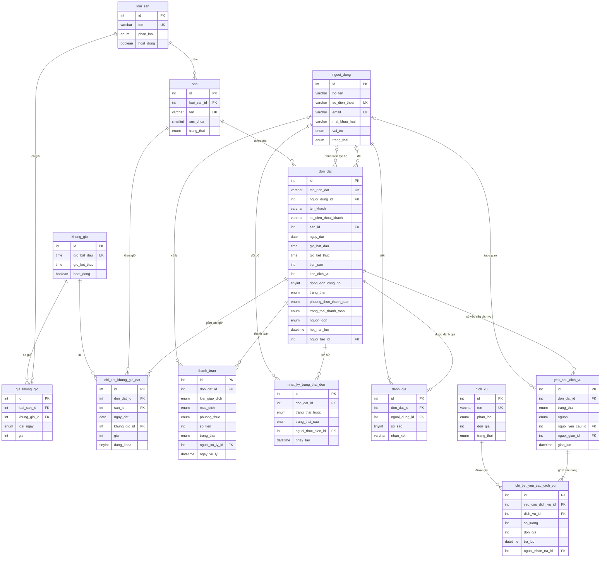

# 01 — DATABASE MySQL

> Trạng thái: **ĐÃ CÓ** (v1.2: dịch vụ phát sinh + khu sự kiện theo góp ý giảng viên; toàn bộ tên bảng và tên cột chuẩn hóa bằng **TIẾNG VIỆT KHÔNG DẤU** `snake_case`). MySQL 8.0.16+ (cần để `CHECK` có hiệu lực). Engine InnoDB, charset `utf8mb4`.

## 1. Nguyên tắc thiết kế

- Mỗi bảng tồn tại vì một nghiệp vụ cụ thể (mục 4).
- **Không xóa cứng** dữ liệu nghiệp vụ. Vô hiệu hóa bằng `hoat_dong` hoặc `trang_thai`.
- **Tiền là số nguyên VND** (`INT UNSIGNED`). Tránh `DECIMAL` vì `mysql2` trả về string.
- Giờ lưu `TIME`, ngày lưu `DATE`, thời điểm lưu `DATETIME` theo múi giờ `+07:00`.
- Giá được **snapshot**: tiền sân vào `chi_tiet_khung_gio_dat.gia`, tiền dịch vụ vào `chi_tiet_yeu_cau_dich_vu.don_gia` (BR-15, BR-23).
- **Hóa đơn không phải một bảng:** hóa đơn của một đơn = `tien_san` + `tien_dich_vu` (chỉ gồm các yêu cầu **đã giao**), tính từ các bảng có sẵn (mục 7.7). Không tạo bảng `hoa_don` riêng để tránh dữ liệu trùng lặp.
- `don_dat.trang_thai_thanh_toan` chỉ phản ánh thanh toán **tiền sân**. Thanh toán tiền dịch vụ theo dõi qua `thanh_toan.muc_dich = 'SERVICE'`.
- Chống trùng lịch bằng **UNIQUE KEY** (mục 3).

## 2. ER Diagram



## 3. Cơ chế chống trùng lịch (quan trọng nhất, phải hiểu để bảo vệ)

Bảng `chi_tiet_khung_gio_dat` có mỗi dòng là **một sân – một ngày – một khung giờ** của một đơn.

```sql
UNIQUE KEY uq_slot_dang_khoa (san_id, ngay_dat, khung_gio_id, dang_khoa)
```

- Khi đơn **đang giữ chỗ hoặc hợp lệ**: `dang_khoa = 1` → chỉ một dòng được tồn tại cho cùng (sân, ngày, giờ). INSERT thứ hai báo `ER_DUP_ENTRY`.
- Khi đơn **bị hủy hoặc hết hạn**: UPDATE `dang_khoa = NULL`. MySQL cho phép **nhiều giá trị NULL** trong UNIQUE index, nên slot được giải phóng nhưng dòng lịch sử vẫn còn.
- Đơn `COMPLETED` và `NO_SHOW` giữ `dang_khoa = 1` (slot đã qua, không ảnh hưởng ai).

Hai người đặt cùng lúc: cả hai cùng INSERT, DB cho một người thành công, người kia nhận `ER_DUP_ENTRY` → backend trả `409 SLOT_TAKEN`. Không cần khóa thủ công.

## 4. Vì sao có từng bảng (13 bảng chuẩn tiếng Việt không dấu)

| Bảng | Nghiệp vụ | Mức |
|---|---|---|
| `nguoi_dung` | Tài khoản cả 3 role (cột `vai_tro`) | P0 |
| `loai_san` | Loại sân (bóng đá mini, cầu lông...), gắn bảng giá; có `phan_loai = EVENT` cho khu tiệc | P0 |
| `san` | Sân cụ thể hoặc phòng tiệc / BBQ, có `suc_chua` và trạng thái hoạt động/bảo trì | P0 |
| `khung_gio` | Khung giờ cố định 1 giờ (06:00 -> 22:00) | P0 |
| `gia_khung_gio` | Ma trận giá `loại sân × khung giờ × ngày thường/cuối tuần` | P0 |
| `don_dat` | Đơn đặt sân: ai, sân nào, ngày nào, tiền sân, tiền dịch vụ, trạng thái | P0 |
| `chi_tiet_khung_gio_dat` | Từng giờ của đơn + giá snapshot + khóa chống trùng `dang_khoa` | P0 |
| `thanh_toan` | Mỗi giao dịch thu tiền sân, thu tiền dịch vụ, hoàn tiền | P0 |
| `nhat_ky_trang_thai_don` | Lịch sử đổi trạng thái đơn (ai, lúc nào) | P1 |
| `danh_gia` | Đánh giá 1–5 sao sau khi hoàn thành | P1 |
| `dich_vu` | Danh mục dịch vụ: đồ uống (`DRINK`), thuê đồ (`RENTAL`), gói tiệc (`PACKAGE`) | P1★ |
| `yeu_cau_dich_vu` | Một lần gọi dịch vụ gắn với đơn sân (`REQUESTED → DELIVERED / CANCELLED`) | P1★ |
| `chi_tiet_yeu_cau_dich_vu` | Từng dòng dịch vụ + giá snapshot + thời điểm trả đồ thuê | P1★ |

## 5. DDL (từ `database/schema.sql`)

Xem trực tiếp nội dung hoàn chỉnh trong file [schema.sql](file:///d:/MonHoc/DatLichSanTheThao/database/schema.sql).

## 6. Danh mục Enum (nguồn sự thật cho Web, Mobile, Backend)

| Trường | Giá trị | Ý nghĩa |
|---|---|---|
| `nguoi_dung.vai_tro` | `CUSTOMER`, `STAFF`, `ADMIN` | Vai trò tài khoản |
| `nguoi_dung.trang_thai` | `ACTIVE`, `LOCKED` | Hoạt động / Khóa |
| `loai_san.phan_loai` | `SPORT`, `EVENT` | Sân thể thao / Khu sự kiện, tiệc (BR-30) |
| `san.trang_thai` | `ACTIVE`, `MAINTENANCE`, `INACTIVE` | Đang dùng / Bảo trì / Ẩn |
| `gia_khung_gio.loai_ngay` | `WEEKDAY`, `WEEKEND` | Ngày thường (T2-T6) / Cuối tuần (T7, CN) |
| `don_dat.trang_thai` | `PENDING`, `CONFIRMED`, `COMPLETED`, `CANCELLED`, `EXPIRED`, `NO_SHOW` | Vòng đời đơn đặt |
| `don_dat.phuong_thuc_thanh_toan` | `CASH`, `BANK_TRANSFER`, `VNPAY` | Tiền mặt / Chuyển khoản / VNPAY (P2) |
| `don_dat.trang_thai_thanh_toan` | `UNPAID`, `PAID`, `REFUNDED` | Trạng thái thanh toán tiền sân |
| `don_dat.nguon_don` | `APP`, `STAFF` | Khách tự đặt / Nhân viên đặt hộ |
| `thanh_toan.loai_giao_dich` | `PAYMENT`, `REFUND` | Thu tiền / Hoàn tiền |
| `thanh_toan.muc_dich` | `COURT`, `SERVICE` | Giao dịch tiền sân / tiền dịch vụ |
| `thanh_toan.trang_thai` | `PENDING`, `SUCCESS`, `FAILED` | Trạng thái giao dịch |
| `dich_vu.phan_loai` | `DRINK`, `RENTAL`, `PACKAGE` | Đồ uống / Thuê đồ / Gói tiệc |
| `dich_vu.trang_thai` | `ACTIVE`, `OUT_OF_STOCK`, `INACTIVE` | Đang bán / Tạm hết / Ngừng bán |
| `yeu_cau_dich_vu.trang_thai` | `REQUESTED`, `DELIVERED`, `CANCELLED` | Chờ giao / Đã giao / Đã hủy |
| `yeu_cau_dich_vu.nguon` | `APP`, `STAFF` | Khách gọi trên app / Nhân viên nhập hộ |

## 7. Truy vấn quan trọng (áp dụng bảng tiếng Việt không dấu)

**7.1 Lịch trống của một sân trong một ngày**
```sql
SELECT kg.id AS khung_gio_id, kg.gio_bat_dau, kg.gio_ket_thuc, gkg.gia,
       (ctkg.id IS NOT NULL) AS da_dat
FROM khung_gio kg
JOIN san s ON s.id = :sanId
LEFT JOIN gia_khung_gio gkg
       ON gkg.loai_san_id  = s.loai_san_id
      AND gkg.khung_gio_id = kg.id
      AND gkg.loai_ngay    = :loaiNgay
LEFT JOIN chi_tiet_khung_gio_dat ctkg
       ON ctkg.san_id       = s.id
      AND ctkg.ngay_dat     = :ngayDat
      AND ctkg.khung_gio_id = kg.id
      AND ctkg.dang_khoa    = 1
WHERE kg.hoat_dong = 1
ORDER BY kg.gio_bat_dau;
```

**7.2 Hết hạn các đơn giữ chỗ quá hạn** (chạy mỗi 60 giây)
```sql
SELECT id FROM don_dat WHERE trang_thai = 'PENDING' AND het_han_luc < NOW() FOR UPDATE;
-- Cập nhật đơn:
UPDATE don_dat SET trang_thai = 'EXPIRED', huy_luc = NOW() WHERE id IN (...) AND trang_thai = 'PENDING';
UPDATE chi_tiet_khung_gio_dat SET dang_khoa = NULL WHERE don_dat_id IN (...);
INSERT INTO nhat_ky_trang_thai_don (don_dat_id, trang_thai_truoc, trang_thai_sau, nguoi_thuc_hien_id, ghi_chu)
VALUES (?, 'PENDING', 'EXPIRED', NULL, 'Hết hạn giữ chỗ');
```

**7.3 Doanh thu theo ngày, tách tiền sân và dịch vụ**
```sql
SELECT DATE(ngay_xu_ly) AS d, muc_dich,
       SUM(CASE WHEN loai_giao_dich = 'PAYMENT' THEN so_tien ELSE -so_tien END) AS doanh_thu
FROM thanh_toan
WHERE trang_thai = 'SUCCESS' AND ngay_xu_ly >= :tuNgay AND ngay_xu_ly < :denNgay
GROUP BY DATE(ngay_xu_ly), muc_dich ORDER BY d;
```

**7.4 Tỷ lệ lấp đầy**
```sql
SELECT COUNT(*) FROM chi_tiet_khung_gio_dat ctkg
JOIN don_dat dd ON dd.id = ctkg.don_dat_id
WHERE ctkg.dang_khoa = 1 AND dd.trang_thai IN ('CONFIRMED','COMPLETED','NO_SHOW')
  AND ctkg.ngay_dat BETWEEN :tuNgay AND :denNgay;
```

**7.5 Số đơn hoạt động của khách** (BR-08)
```sql
SELECT COUNT(*) FROM don_dat
WHERE nguoi_dung_id = :uid AND trang_thai IN ('PENDING','CONFIRMED')
  AND TIMESTAMP(ngay_dat, gio_ket_thuc) > NOW();
```

**7.6 Sân có đơn tương lai không** (BR-05)
```sql
SELECT COUNT(*) FROM don_dat
WHERE san_id = :sanId AND trang_thai IN ('PENDING','CONFIRMED')
  AND TIMESTAMP(ngay_dat, gio_ket_thuc) > NOW();
```

**7.7 Hóa đơn của một đơn**
```sql
SELECT dd.tien_san, dd.tien_dich_vu,
       dd.tien_san + dd.tien_dich_vu AS tong_cong,
       COALESCE(SUM(CASE WHEN tt.loai_giao_dich = 'PAYMENT' AND tt.trang_thai = 'SUCCESS' THEN tt.so_tien END), 0) AS da_tra,
       COALESCE(SUM(CASE WHEN tt.loai_giao_dich = 'PAYMENT' AND tt.trang_thai = 'SUCCESS' AND tt.muc_dich = 'SERVICE' THEN tt.so_tien END), 0) AS dich_vu_da_tra
FROM don_dat dd
LEFT JOIN thanh_toan tt ON tt.don_dat_id = dd.id
WHERE dd.id = :id
GROUP BY dd.id;
```

**7.8 Hàng đợi yêu cầu dịch vụ chờ giao**
```sql
SELECT ycdv.id, ycdv.ngay_tao, ycdv.ghi_chu, dd.ma_don_dat, dd.ngay_dat, dd.gio_bat_dau, dd.gio_ket_thuc, s.ten AS ten_san
FROM yeu_cau_dich_vu ycdv
JOIN don_dat dd ON dd.id = ycdv.don_dat_id
JOIN san s ON s.id = dd.san_id
WHERE ycdv.trang_thai = 'REQUESTED'
ORDER BY ycdv.ngay_tao;
```

**7.9 Đồ thuê chưa nhận lại của một đơn** (BR-28)
```sql
SELECT ctycdv.id, dv.ten, ctycdv.so_luong
FROM chi_tiet_yeu_cau_dich_vu ctycdv
JOIN yeu_cau_dich_vu ycdv ON ycdv.id = ctycdv.yeu_cau_dich_vu_id AND ycdv.trang_thai = 'DELIVERED'
JOIN dich_vu dv ON dv.id = ctycdv.dich_vu_id AND dv.phan_loai = 'RENTAL'
WHERE ycdv.don_dat_id = :id AND ctycdv.tra_luc IS NULL;
```

**7.10 Cập nhật cache `tien_dich_vu`** (BR-25, BR-26)
```sql
UPDATE don_dat dd
SET dd.tien_dich_vu = COALESCE((
  SELECT SUM(ctycdv.so_luong * ctycdv.don_gia)
  FROM yeu_cau_dich_vu ycdv JOIN chi_tiet_yeu_cau_dich_vu ctycdv ON ctycdv.yeu_cau_dich_vu_id = ycdv.id
  WHERE ycdv.don_dat_id = dd.id AND ycdv.trang_thai = 'DELIVERED'), 0)
WHERE dd.id = :id;
```

**7.11 Dịch vụ bán chạy**
```sql
SELECT dv.id, dv.ten, dv.phan_loai, SUM(ctycdv.so_luong) AS so_luong, SUM(ctycdv.so_luong * ctycdv.don_gia) AS doanh_so
FROM chi_tiet_yeu_cau_dich_vu ctycdv
JOIN yeu_cau_dich_vu ycdv ON ycdv.id = ctycdv.yeu_cau_dich_vu_id AND ycdv.trang_thai = 'DELIVERED'
JOIN dich_vu dv ON dv.id = ctycdv.dich_vu_id
WHERE ycdv.giao_luc >= :tuNgay AND ycdv.giao_luc < :denNgay
GROUP BY dv.id, dv.ten, dv.phan_loai
ORDER BY doanh_so DESC LIMIT 10;
```

**7.12 Đơn quá giờ chưa xử lý** (BR-33, STF-02)
```sql
SELECT COUNT(*) FROM don_dat
WHERE trang_thai = 'CONFIRMED' AND TIMESTAMP(ngay_dat, gio_ket_thuc) < NOW();
```
