# 02 — UML DIAGRAMS (Mermaid)

> Trạng thái: **ĐỀ XUẤT / CHƯA TRIỂN KHAI**. Sơ đồ viết bằng Mermaid, xem trực tiếp trên GitHub, VS Code (extension Markdown Preview Mermaid) hoặc dán vào https://mermaid.live để xuất ảnh đưa vào báo cáo.
> Mọi sơ đồ khớp với `03-actors-functions.md` (BR-xx, mã chức năng), `01-database.md` (bảng, enum) và `06-api.md` (endpoint). ER Diagram nằm ở `01-database.md` mục 2.

## 1. Use Case Diagram

Mermaid không có sơ đồ use case chuẩn, nên dùng flowchart mô phỏng (actor là hình tròn, use case là hình bầu dục). Khi vẽ lại trong StarUML/draw.io, giữ nguyên danh sách use case và quan hệ.

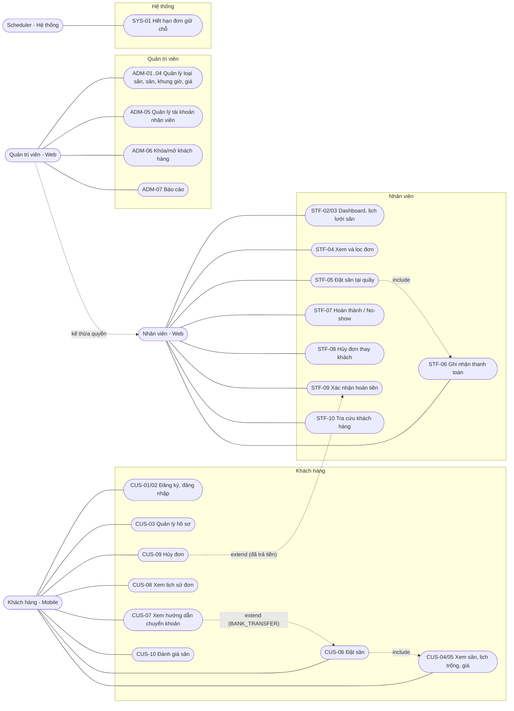

Ghi chú: `STF-08`/`STF-09` kích hoạt tạo/hoàn tất `REFUND` (BR-10). Admin kế thừa mọi use case của nhân viên.

## 2. Activity Diagram

### 2.1 Khách đặt sân từ Mobile (CUS-05 → CUS-07)

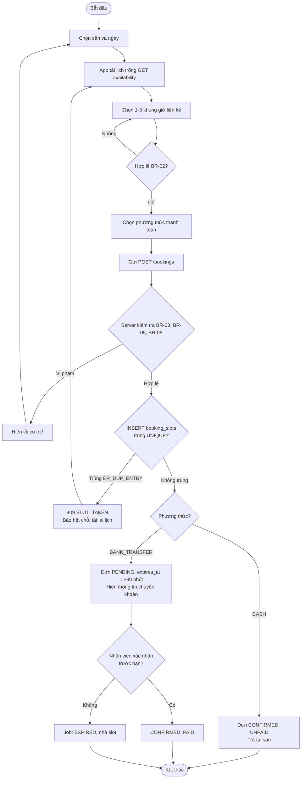

### 2.2 Nhân viên xử lý đơn trong ngày (STF-04 → STF-07)

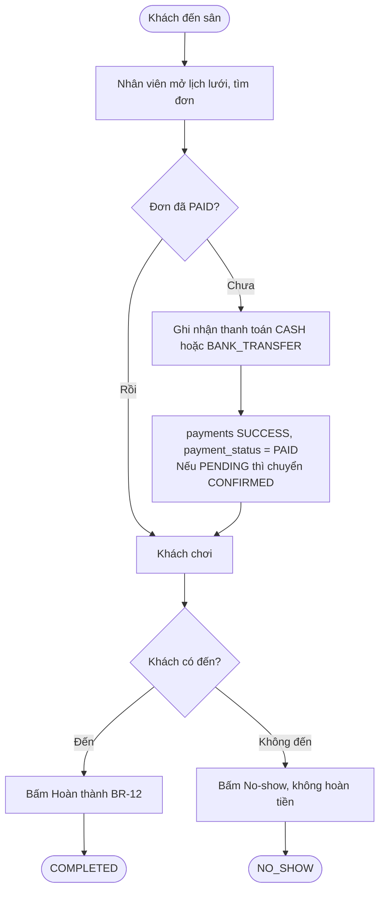

### 2.3 Hủy đơn và hoàn tiền (CUS-09, STF-08, STF-09)

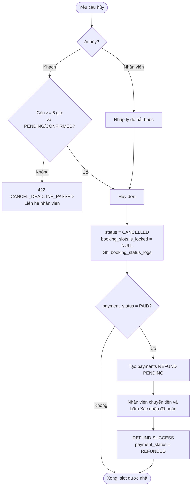

## 3. Sequence Diagram

### 3.1 Đăng nhập (CUS-02, STF-01)

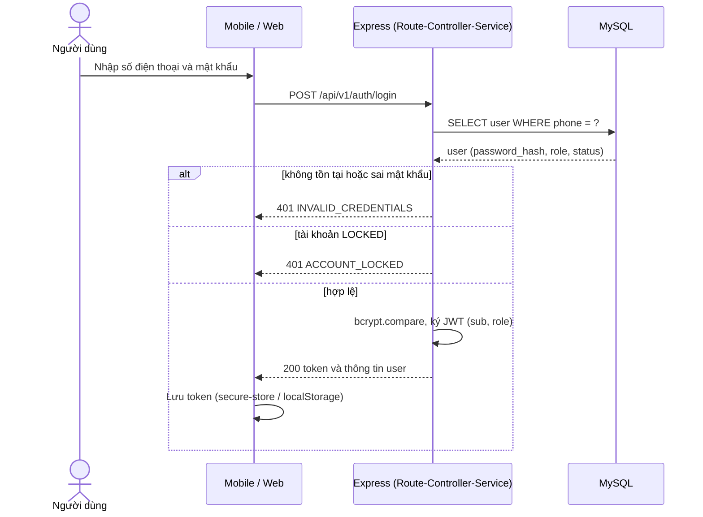

### 3.2 Đặt sân bằng chuyển khoản (CUS-06)

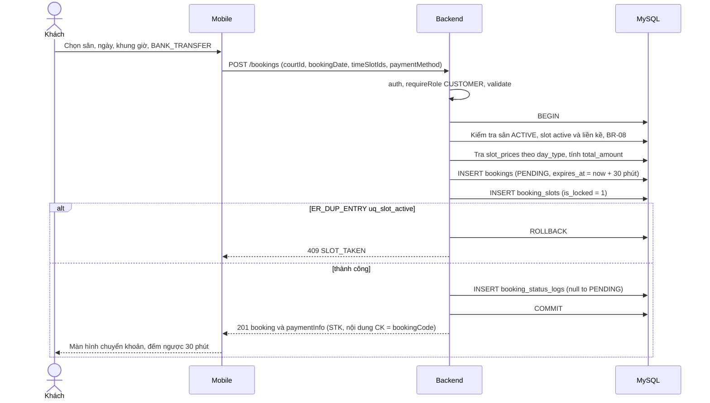

### 3.3 Nhân viên xác nhận thanh toán (STF-06)

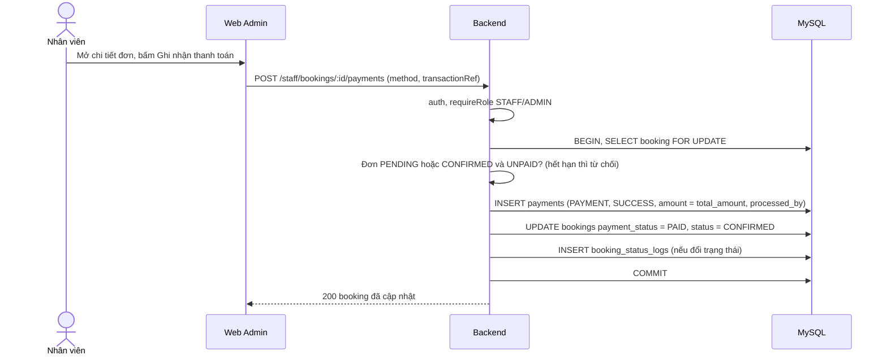

### 3.4 Khách hủy đơn đã thanh toán (CUS-09 → STF-09)

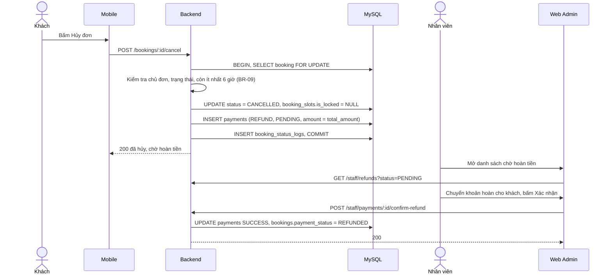

### 3.5 Job hết hạn giữ chỗ (SYS-01)

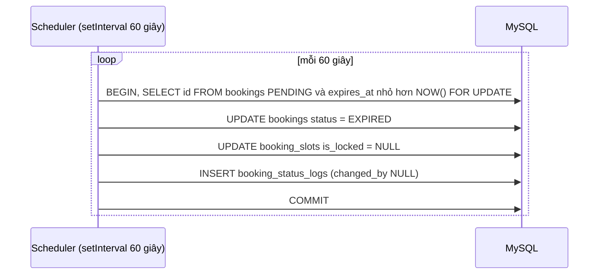

## 4. State Diagram

### 4.1 Trạng thái đơn đặt sân (`bookings.status`)

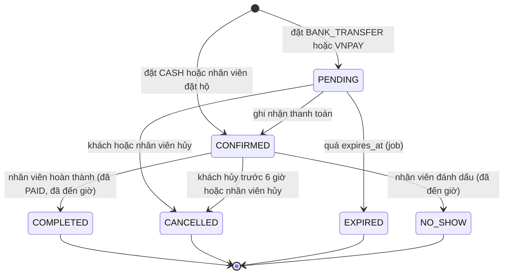

Bảng chuyển trạng thái hợp lệ (service phải kiểm tra, mọi cặp khác bị từ chối `409 INVALID_STATUS`):

| Từ | Sang | Ai | Điều kiện |
|---|---|---|---|
| (mới) | PENDING | Khách | `BANK_TRANSFER`/`VNPAY` |
| (mới) | CONFIRMED | Khách / Nhân viên | `CASH`, hoặc nhân viên đặt hộ |
| PENDING | CONFIRMED | Nhân viên / (VNPay callback) | Còn hạn `expires_at` |
| PENDING | EXPIRED | Hệ thống | `expires_at < NOW()` |
| PENDING, CONFIRMED | CANCELLED | Khách | Còn ≥ 6 giờ (BR-09) |
| PENDING, CONFIRMED | CANCELLED | Nhân viên | Có lý do |
| CONFIRMED | COMPLETED | Nhân viên | `PAID` và đã đến giờ (BR-12) |
| CONFIRMED | NO_SHOW | Nhân viên | Đã đến giờ (BR-12) |

### 4.2 Trạng thái thanh toán (`bookings.payment_status`)

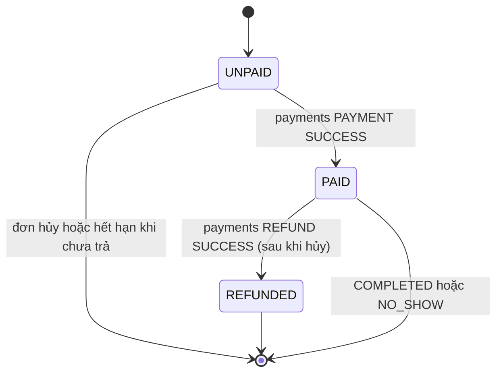

## 5. Class Diagram (mô hình miền, khớp bảng DB)

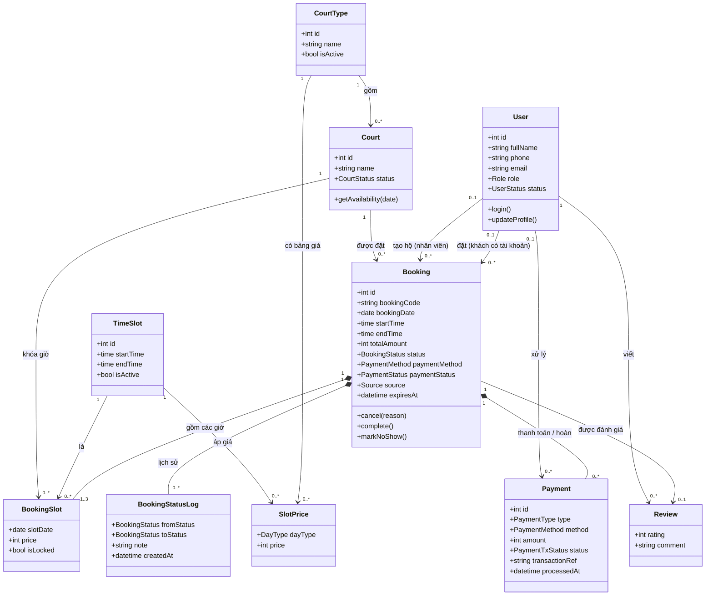

Ghi chú: `Booking *-- BookingSlot` là composition (xóa đơn thì mất các giờ). Thực tế không xóa cứng (BR-14).

## 6. Kiểm tra khớp UML ↔ hệ thống

| Thành phần UML | Khớp với |
|---|---|
| Use case CUS/STF/ADM/SYS | `03-actors-functions.md` mục 4 |
| State đơn | `01-database.md` mục 6 (`bookings.status`) và `06-api.md` mục 5 |
| Class | Bảng trong `01-database.md` mục 5 |
| Sequence | Endpoint trong `06-api.md` |
| Ma trận truy vết đầy đủ | `10-sync-check.md` mục 1 |
