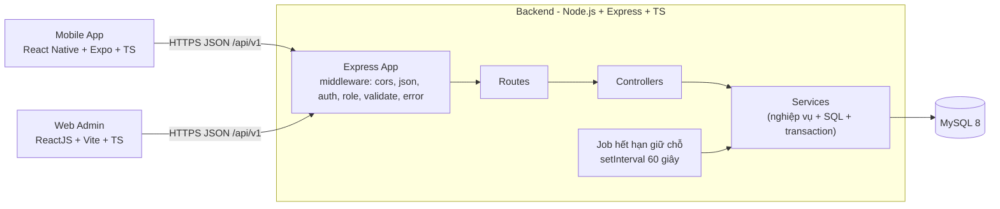

# 07 — KIẾN TRÚC HỆ THỐNG, CÔNG NGHỆ, DỮ LIỆU DÙNG CHUNG

> Trạng thái: **ĐỀ XUẤT / CHƯA TRIỂN KHAI**. Việc project hiện có đã theo kiến trúc này chưa: **CHƯA ĐỦ DỮ LIỆU** (đối chiếu bằng `10-sync-check.md` mục 6).

## 1. Kiến trúc tổng thể



- **Một backend duy nhất**, hai frontend cùng gọi `/api/v1`. Không có lý do kiến trúc để tách (không có yêu cầu scale độc lập, không có hai đội).
- **Stateless:** xác thực bằng JWT, không lưu session trên server.
- **Không** có message queue, cache, microservice, WebSocket.

## 2. Phân tầng Backend

| Tầng | Trách nhiệm | Ví dụ file |
|---|---|---|
| Route | Khai báo URL, gắn middleware | `routes/booking.routes.ts` |
| Controller | Đọc request, gọi service, trả response | `controllers/booking.controller.ts` |
| Service | Nghiệp vụ, SQL, transaction | `services/booking.service.ts` |
| Middleware | Auth, role, validate, lỗi | `middlewares/*.ts` |
| Utils | `ApiError`, `response`, `jwt`, `password`, `toCamel`, `withTransaction`, `logStatusChange` | `utils/*.ts` |
| Config | env, pool MySQL, hằng số nghiệp vụ | `config/*.ts` |
| Jobs | Tác vụ định kỳ | `jobs/expire-bookings.job.ts` |

Luồng một request: `Route → [auth → requireRole → validate] → Controller → Service → MySQL` và `Service → Controller → response`. Lỗi: bất kỳ tầng nào `throw ApiError` → `error.middleware` chuẩn hóa thành response lỗi.

## 3. Cấu trúc thư mục

### 3.1 Backend
```
backend/
├── package.json
├── tsconfig.json
├── .env.example
└── src/
    ├── server.ts                  # khởi động: listen + start job
    ├── app.ts                     # tạo Express app, gắn middleware, routes
    ├── config/
    │   ├── env.ts                 # đọc và validate biến môi trường
    │   ├── db.ts                  # mysql2 pool (timezone '+07:00', dateStrings: true)
    │   └── business.ts            # hằng số nghiệp vụ (AGENT.md mục 13)
    ├── routes/
    │   ├── index.ts               # gắn các router dưới /api/v1
    │   ├── auth.routes.ts
    │   ├── catalog.routes.ts      # court-types, courts, time-slots, config/public
    │   ├── booking.routes.ts      # /bookings (CUSTOMER)
    │   ├── staff.routes.ts        # /staff/*
    │   └── admin.routes.ts        # /admin/*
    ├── controllers/               # mỗi file ứng với một service
    ├── services/
    │   ├── auth.service.ts
    │   ├── catalog.service.ts
    │   ├── booking.service.ts     # đặt, hủy, lịch trống, đặt tại quầy
    │   ├── payment.service.ts     # ghi nhận thanh toán, hoàn tiền
    │   ├── staff.service.ts       # dashboard, schedule, customers
    │   ├── admin.service.ts       # CRUD cấu hình, tài khoản
    │   └── report.service.ts
    ├── middlewares/
    │   ├── auth.middleware.ts
    │   ├── role.middleware.ts
    │   ├── validate.middleware.ts
    │   └── error.middleware.ts
    ├── validators/                # zod schema theo module
    ├── utils/
    ├── jobs/expire-bookings.job.ts
    └── types/                     # kiểu TS dùng chung (AuthUser, enum...)
```
Cấu hình `mysql2`: `dateStrings: true` (trả DATE/TIME/DATETIME dạng chuỗi, tránh lệch múi giờ khi JS tự chuyển), `timezone: '+07:00'`.

### 3.2 Web Admin
```
web-admin/src/
├── main.tsx, App.tsx              # router + AuthProvider
├── api/ client.ts, auth.api.ts, booking.api.ts, admin.api.ts ...
├── auth/ AuthContext.tsx, RequireRole.tsx
├── components/                    # AppLayout, DataTable, StatusBadge, Money, FormModal ...
├── pages/                         # mỗi route ở mục 2 của 05-pages-sitemap.md một thư mục
├── types/                         # kiểu theo 06-api.md
├── utils/ format.ts               # tiền, ngày, giờ
└── styles/ theme.css
```

### 3.3 Mobile
```
mobile/
├── app/                           # Expo Router (xem 05-pages-sitemap.md mục 1)
├── src/
│   ├── api/ client.ts ...
│   ├── auth/ AuthContext.tsx      # lưu token bằng expo-secure-store
│   ├── components/
│   ├── theme.ts
│   ├── types/
│   └── utils/format.ts
└── app.json
```

## 4. Công nghệ và thư viện

Cột **Quyết định**: **BẮT BUỘC** (theo đề bài), **DÙNG** (đề xuất nên dùng), **TÙY CHỌN**, **KHÔNG DÙNG** (không cần, đừng thêm). Việc project hiện tại đang dùng gì: **CHƯA ĐỦ DỮ LIỆU**; nếu đã có thư viện thuộc nhóm KHÔNG DÙNG thì đánh giá có thể gỡ (xem `10-sync-check.md`).

### 4.1 Backend
| Thư viện | Quyết định | Lý do |
|---|---|---|
| Node.js (LTS), Express, TypeScript | BẮT BUỘC | Theo đề bài |
| `mysql2` | DÙNG | Driver MySQL, viết SQL thuần, minh bạch khi bảo vệ |
| `zod` | DÙNG | Validate đầu vào ngắn gọn, có kiểu TS |
| `jsonwebtoken` | DÙNG | JWT |
| `bcryptjs` | DÙNG | Băm mật khẩu (thuần JS, không cần build native) |
| `cors`, `dotenv` | DÙNG | Cần thiết |
| `tsx` (hoặc `ts-node-dev`) | DÙNG (dev) | Chạy TS khi phát triển |
| `helmet` | TÙY CHỌN | Thêm header bảo mật, nhẹ |
| `express-rate-limit` | TÙY CHỌN | Chặn dò mật khẩu ở `/auth/login` |
| `morgan` | TÙY CHỌN | Log request |
| Prisma / Sequelize / TypeORM | KHÔNG DÙNG | Thêm một lớp trừu tượng, khó giải thích SQL và chống trùng lịch |
| `node-cron`, Bull, Redis | KHÔNG DÙNG | `setInterval` là đủ |
| Socket.IO | KHÔNG DÙNG | Không realtime |

### 4.2 Web
| Thư viện | Quyết định | Lý do |
|---|---|---|
| React + TypeScript + Vite | BẮT BUỘC / DÙNG | Theo đề bài; Vite nhẹ, nhanh |
| `react-router-dom` | DÙNG | Điều hướng |
| `axios` | DÙNG | HTTP client có interceptor |
| `recharts` | TÙY CHỌN | Chỉ cho một biểu đồ báo cáo (P1) |
| `dayjs` | TÙY CHỌN | Xử lý ngày; có thể dùng `Intl`/`Date` thuần |
| Ant Design | TÙY CHỌN | Chỉ nếu chọn UI framework, dùng nhất quán |
| Redux, React Query, Formik | KHÔNG DÙNG | Context + hooks + `useState` là đủ cho phạm vi này |

### 4.3 Mobile
| Thư viện | Quyết định | Lý do |
|---|---|---|
| React Native + Expo + TypeScript | BẮT BUỘC | Theo đề bài |
| `expo-router` | DÙNG | Điều hướng chuẩn của Expo |
| `axios` | DÙNG | Dùng chung cách gọi API với Web |
| `expo-secure-store` | DÙNG | Lưu token an toàn |
| `@expo/vector-icons` | DÙNG | Icon có sẵn trong Expo |
| Date picker ngoài | KHÔNG DÙNG | Tự làm `DateStrip` 15 ngày, đơn giản hơn |
| Redux, NativeWind, UI kit nặng | KHÔNG DÙNG | Không cần |
| Expo Push Notifications | TÙY CHỌN (P2) | Chỉ khi làm thông báo |

### 4.4 Database / công cụ
MySQL 8.0.16+ (bắt buộc `CHECK`), công cụ quản trị tùy chọn (MySQL Workbench/DBeaver), Postman hoặc REST Client để thử API, Git.

## 5. Bảo mật (đủ cho đồ án, dễ giải thích)

| Hạng mục | Cách làm |
|---|---|
| Mật khẩu | `bcryptjs` cost 10; không lưu/log mật khẩu thô |
| Xác thực | JWT hạn 1 ngày, secret trong `.env` |
| Phân quyền | `requireRole` ở **server**, kiểm tra DB mỗi request (khóa tài khoản có hiệu lực ngay) |
| Dữ liệu cá nhân | Khách chỉ truy cập đơn của mình (lọc theo `user_id`) |
| SQL Injection | 100% truy vấn tham số hóa `?` |
| Giá và tổng tiền | Server tự tính, không tin client |
| Đồng thời | UNIQUE KEY + transaction |
| CORS | Chỉ cho `CORS_ORIGIN` (Web); Mobile không bị CORS |
| Lộ lỗi | `error.middleware` che chi tiết, trả `INTERNAL_ERROR` cho lỗi lạ |
| Bí mật | `.env` không commit; chỉ commit `.env.example` |

## 6. Dữ liệu dùng chung (Shared Data)

### 6.1 Giữa các tầng
| Dữ liệu | Nguồn sự thật | Ai dùng |
|---|---|---|
| Enum (role, status, payment...) | `01-database.md` mục 6 | DB, Backend, Web, Mobile phải **cùng giá trị** |
| Hợp đồng API (field, mã lỗi) | `06-api.md` | Backend, Web, Mobile |
| Quy tắc nghiệp vụ | `03-actors-functions.md` | Backend (thực thi), FE (hiển thị) |
| Hằng số (14 ngày, 30 phút, 6 giờ, 3 slot) | `backend/src/config/business.ts` | Backend; FE đọc qua `GET /config/public` |
| Màu và nhãn trạng thái | `05-pages-sitemap.md` mục 4.3 | Web, Mobile (mỗi nơi một file `status.ts`) |

**Không** tạo package `shared` dùng chung giữa 3 project (phức tạp build/monorepo tooling). Mỗi FE giữ thư mục `types/` tự viết theo `06-api.md`.

### 6.2 Dữ liệu cấu hình (admin sửa, mọi client đọc)
`court_types`, `courts`, `time_slots`, `slot_prices` (và `services` ở P2). Client có thể cache vài phút; sau khi admin sửa giá thì lịch trống lần tải sau đã dùng giá mới.

## 7. Triển khai (đề xuất cho đồ án)

- **Chạy cục bộ** là đủ: MySQL cài sẵn (XAMPP/MySQL Server), backend `npm run dev` cổng 4000, web `npm run dev` cổng 5173, mobile `npx expo start` (điện thoại thật cùng Wi-Fi: API URL dùng IP máy tính, không dùng `localhost`).
- Cấu hình URL API ở FE bằng biến môi trường (`VITE_API_URL`, `EXPO_PUBLIC_API_URL`).
- Triển khai thật (VPS, Railway, Render...) là **tùy chọn**, không thuộc phạm vi bắt buộc.
